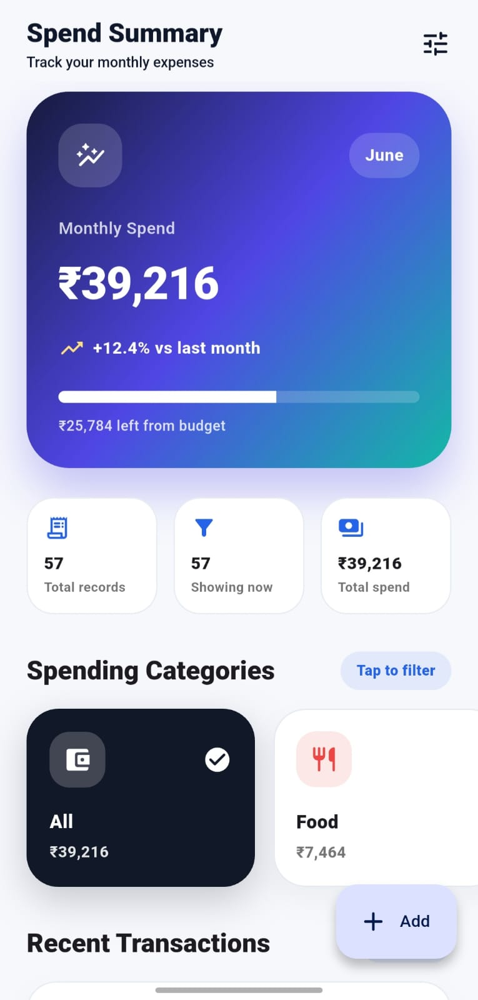
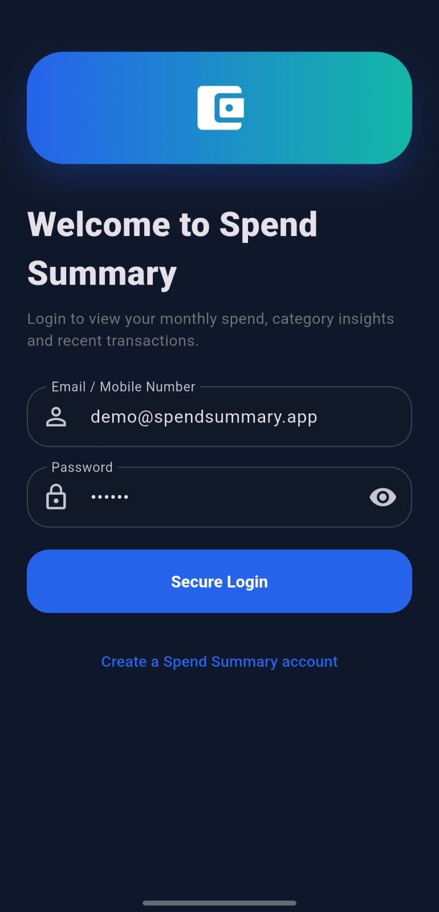
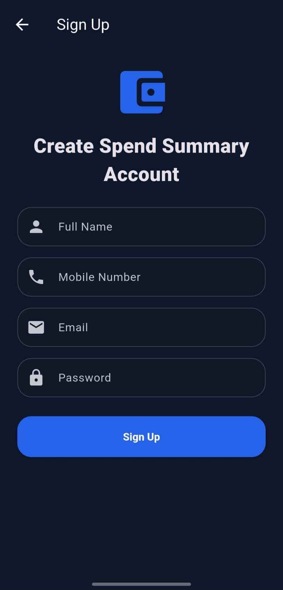
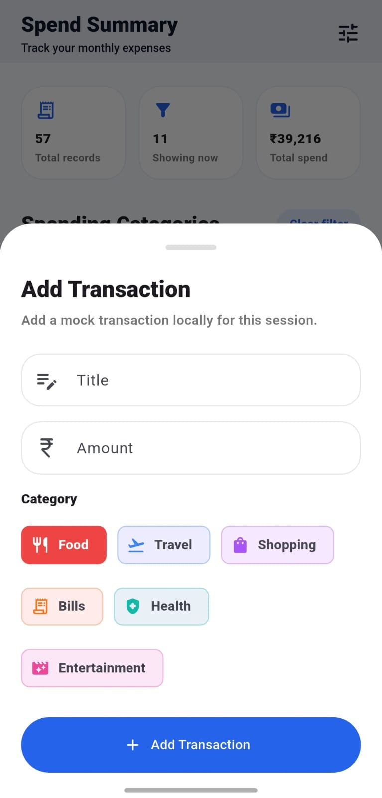
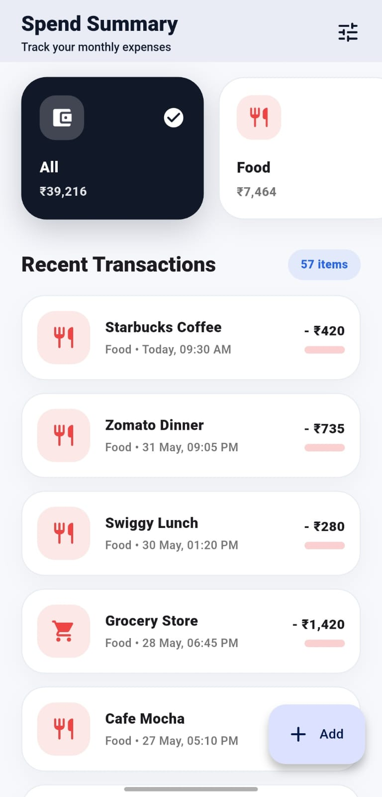
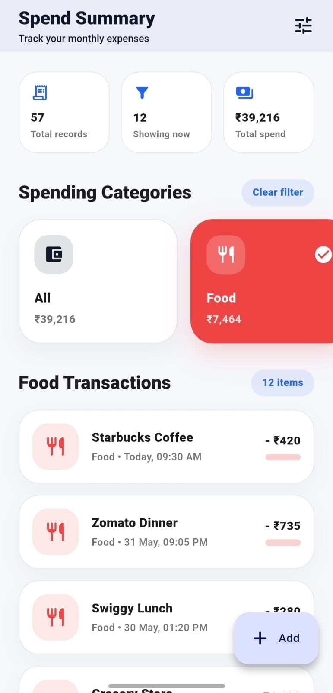
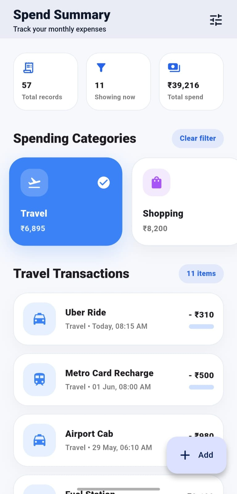
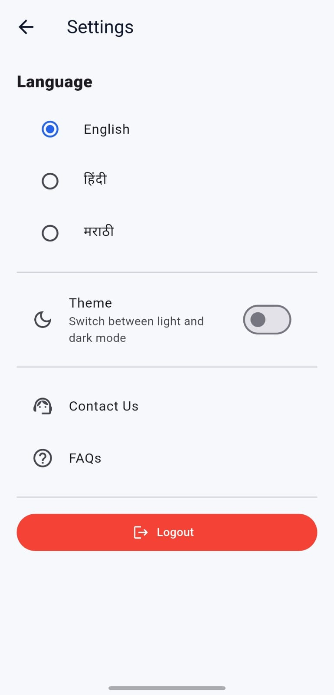
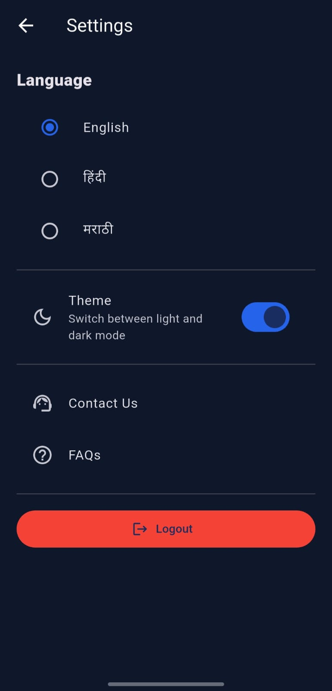

# Spend Summary

A polished Flutter take-home assignment app that shows a modern monthly spend dashboard using mock JSON data only.

## Features

- Professional app flow: Splash → Permissions → Intro/Onboarding → Login → Spend Summary Dashboard
- Spend Summary branded login and signup screens
- Monthly spend header card with amount, budget progress, and percentage change vs last month
- Professional horizontal category filter with icons, amounts, selected state, and clear filter option
- 57 recent transactions loaded from JSON mock data
- Category-wise transaction color coding
- Floating Action Button to add a new transaction
- Added transactions update the dashboard immediately:
  - Monthly spend total
  - Budget progress
  - Percentage change vs last month
  - Category amount
  - Transaction count
  - Recent transaction list

- FAQ screen with Spend Summary specific questions
- Contact Us screen with Spend Summary support information
- Form validation for title and amount
- Smooth animations, rounded cards, shadows, responsive spacing, and dark-mode friendly UI
- No backend/API required

## Mock Data

Data is loaded from:

```text
assets/data/spend_summary.json
```

The JSON file contains monthly spend details, category details, and 57 transaction records.

## AI Tools Used

- ChatGPT was used for UI planning, Flutter widget structure, JSON mock data preparation, debugging support, and README improvement.
- AI assistance was used to speed up development within the given 2–3 hour assignment limit.
- Final code was reviewed and adjusted manually to ensure the UI, filtering, add transaction flow, and dashboard updates work correctly.

## Time Limit Note

This assignment was implemented with the expected 2–3 hour take-home task scope in mind. The focus was on clean UI, smooth interactions, reusable widgets, and correct mock-data handling rather than backend integration.

## Run Commands

```bash
flutter pub get
flutter run
```

Optional checks:

```bash
flutter analyze
flutter build apk --release
```

## Screenshots

### Dashboard



### Sign In



### Sign Up



### Add Spend



### Spending Categories



### Food Spend



### Travel Spend



### Settings



### Theme Changes


